## BAMAZON
---
### Overview
---

MySQL Database

The data for the application is stored in a MySql database called 'bamazon'.
The table name is 'products'.

Customer Module

* Show all available products, with a quantity greater than zero
* Allow the customer to purchase the product, using the product ID and enter a quantity to purchase
* Prevent the purchase, if the quantity to purchase is greater than that ID's stock quantity 
  then a message will be displayed stating that there is not enough quantity to make the purchse, 
  and to adjust the desired quantity to purchase
* It will show the customer's total purhase price
* Reduce that product's stock quantity by the quantity purchased
* Redisplay all available products

Manager Module

Displays a menu of choices for the manager to select:

*  `View Products for Sale` list every available item: the item IDs, names, prices, and quantities
*  `View Low Inventory` list all items with an inventory count lower than five
*  `Add to Inventory` increase the current stock quantity of any item currently in the store
*  `Add New Product` add a new product to the inventory by providing name, department name, price and quantity
*  `Exit` exits out of the Manager module
  
---
### MySql Database
---

MySQL Database called `bamazon`, with table called `products`.
The table has the following fields:

   * item_id (unique id for each product)
   * product_name (Name of product)
   * department_name
   * price (cost to customer)
   * stock_quantity (how much of the product is available in stores)

MySQL Database:

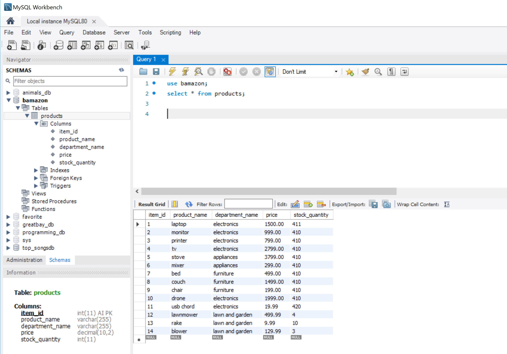

---
### Customer Module
---
To run the Customer module, go to a command prompt (Windows) or terminal prompt (Mac) and type:

`node bamazonCustomer`

The app will display a welcome message and all available products.
Available products are the items with a quantity of greater than zero.
If an item's quantity reaches zero then it will not be displayed.

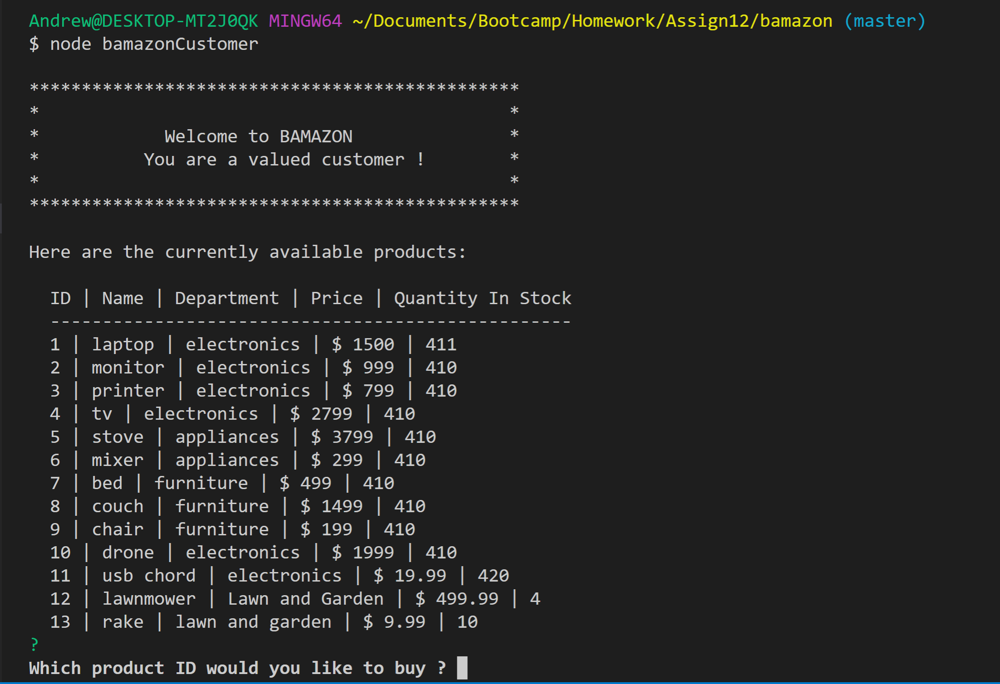

---
####  Normal Customer Purchase
---
Let's walk through a purchase of item ID #1. The current stock quantity for item id 1 is 411.

``Enter 1 into the prompt for  "Which product ID would you like to buy ?" ``

``Enter 1 into the quantity  "Enter the quantity that you would like to buy ?"``

Note:   You have the option to enter a 0 quantity to start over or a -1 to exit the app

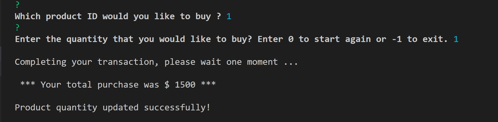

The stock quantity for item id 1 has been reduced from 411 to 410.

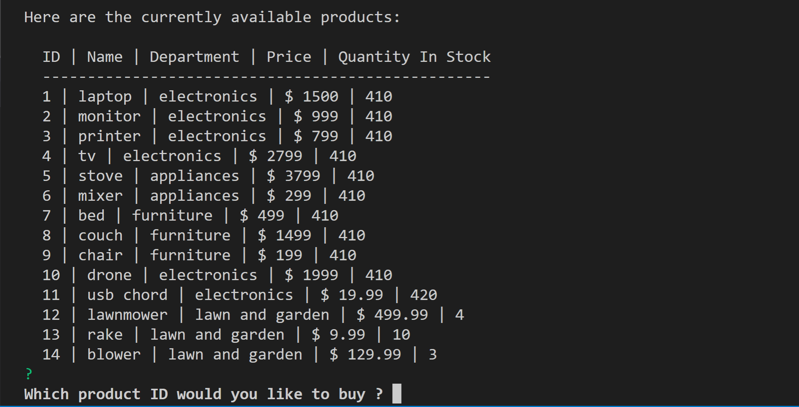

---
####  Quantity to Purchase Exceeds Item's Stock Quantity
---

Let's purchase item id 1 again, but let's try to purchase more than 410, say 4100.

The program will display the message below, and then redisplay the available products.

   `*** Sorry, we don't have that much in stock, please adjust your quantity. ***`

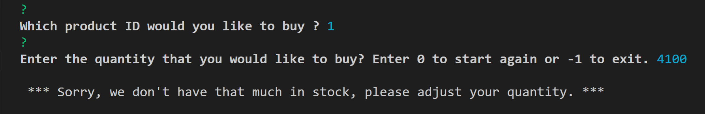

---
####  All Remaining Quantity Purchased, Item Removed from Available Products list
---

An item is not displayed if the stock quantity is equal to zero.
Let's purchase all the remaining quantity of item id 14.

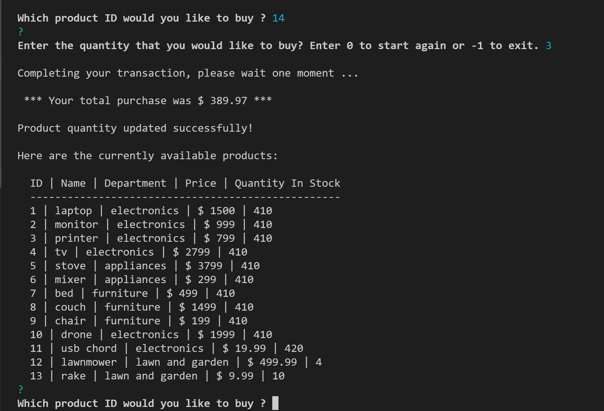

Note that item id 14 is no longer displayed for an available product.

---
### Manager Module
---
To run the Manager module, go to a command prompt (Windows) or terminal prompt (Mac) and type:

`node bamazonManager`

The app will display a welcome message and a menu list for the Manager to select from:

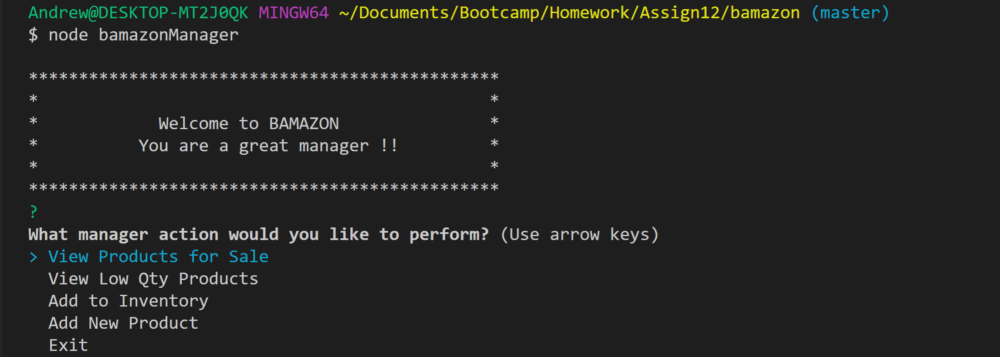

Let's walk through the menu choices.

---
####  View Products for Sale
---
This menu selection will display all products, regardless of their stock quantity.
Then, the Manager's menu list will be redisplayed.

Note that item id 14 is displayed with a quantity of zero.

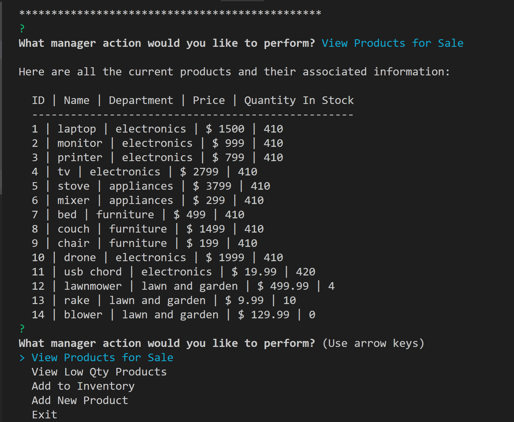

---
####  View Low Qty Products
---
This menu selection will display all products, with a stock quantity of less than 5, and
then redisplay the manager's menu.

Note that only items 12 and 14 are displayed.

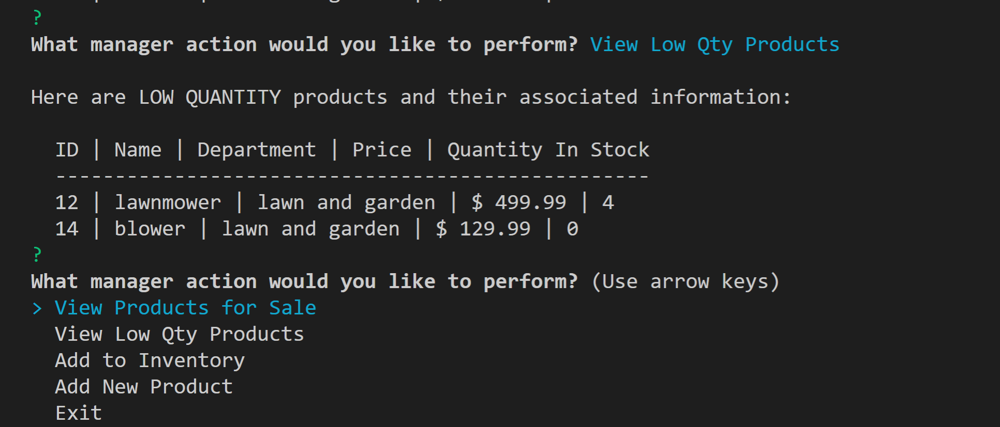

---
####  Add to Inventory
---
The manager can now add to any existing item id's quantity, by selecting this menu choice.
Then entering an item id and then a quantity that should be added to that items current quantity.

Let's add 10 items back to item 14, the blower.

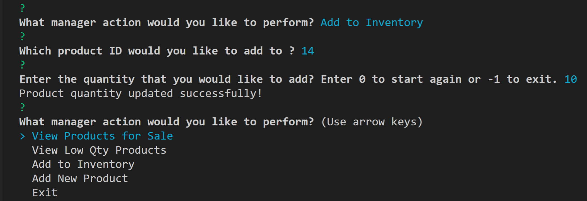

Now, let's use the "View Products for Sale" menu item to confirm, that we see item 14 now has a quantity of 10.

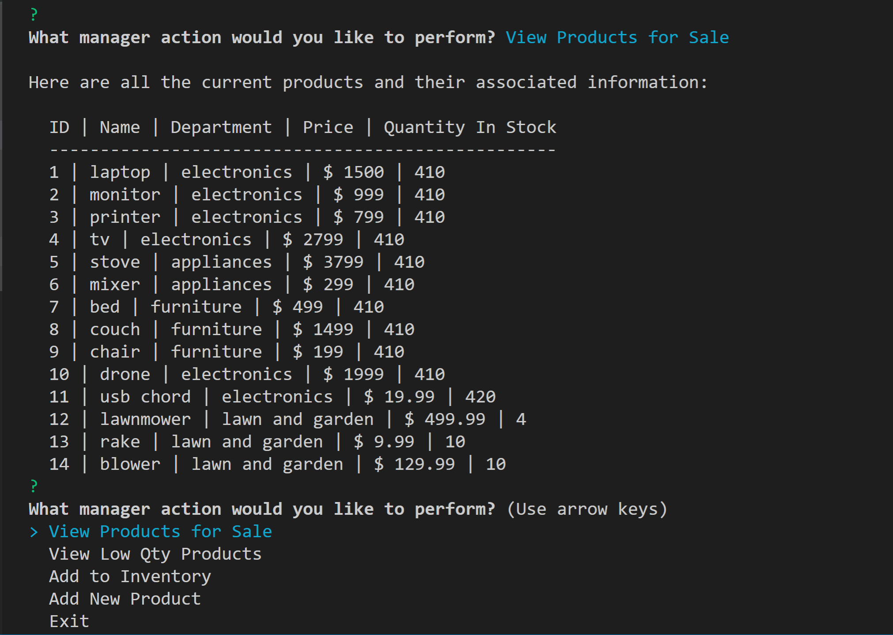

Then, the Manger's menu list is redisplayed.

---
####  Add New Product
---
The manager can now add a new product item, by selecting this menu choice, and 
then entering the new item's name, department name, price and beginning quantity.

Let's add a new item called 'ipad' with a department name of 'electronics' with a price of $ 799.99
and a quantity of 10.

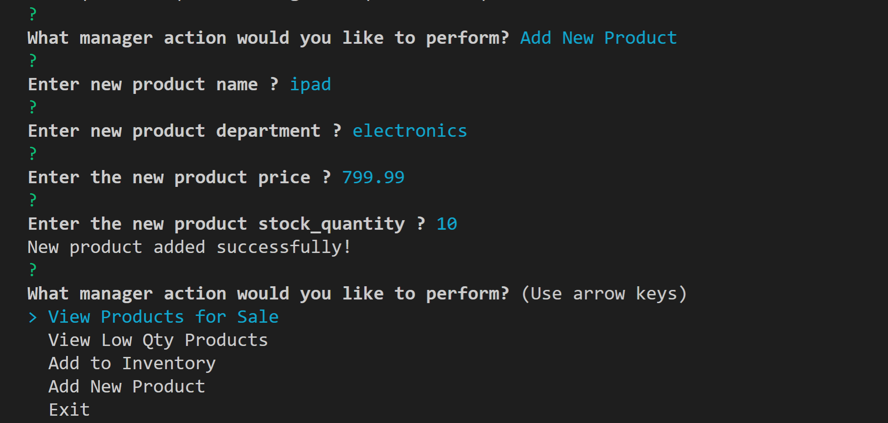

Now, let's use the "View Products for Sale" menu item to confirm, that we see the new item 'ipad'.

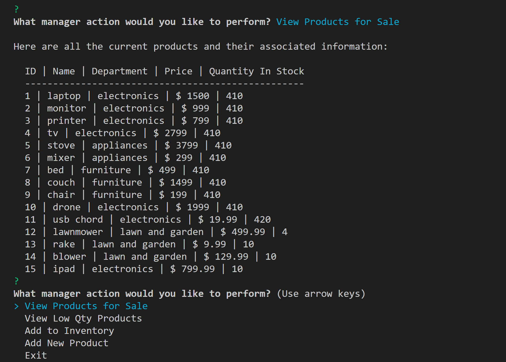

Then, the Manger's menu list is redisplayed.

---
####  Exit
---

This simply exits the Manager module, back to the command prompt or terminal window.

